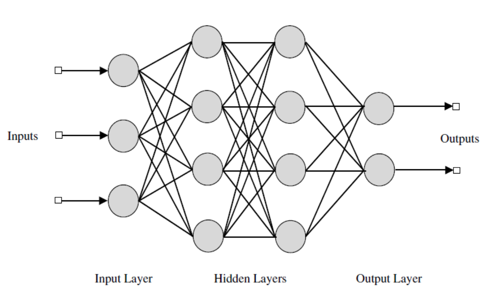

#### Architecture of multilayer feedforward neural network

It can be shown that a multilayer feedforward neural network (MLFFNN) with at least two intermediate layers in addition to the input and output layers can perform any pattern classification task. For this to be true, the units in the hidden layers and the output layer must be nonlinear in nature. Such an MLFFNN can be used for pattern mapping tasks. Given a set of input-output pairs of pattern vectors, the task of pattern mapping involves determining the set of weights which can transform the input vectors into the output vectors. Thus, a systematic way of updating the weights is required. To update the weights in a supervised manner, it is necessary to know the desired output for each unit in the hidden and the output layers. Once the desired output for a unit is known, the error between the desired output and the actual output can be computed. This error, in turn, can be used to modify the weights associated with the unit. However, the desired output is known only for the units in the output layer, and not for the units in the hidden layers. This issue is addressed by employing backpropagation algorithm.

**Figure 1**: *Architecture of a multilayer feedforward neural network*
### Backpropagation learning rule for modifying the weights of MLFFNN
#### Nature of error surface

In order to obtain the desired outputs for units in the hidden layer, the approach followed is the gradient descent along the error surface. The error is defined as the squared difference between the desired output pattern (which is the given output vector) and the actual output vector obtained at the output layer of the network, given an input pattern. Note that the application of an input pattern produces an output pattern from the network. The sum of errors obtained for each input-output pattern pair can be considered as the overall error. The overall error is a function of all the weights of the MLFFNN. All the weights of the MLFFNN can be represented as a weight vector. The weight vector is a point in the multidimensional weight space. Thus, the overall error as a function of the weight vector can be viewed as an error surface, for different values of the weight vector. The goal is to obtain that value of the weight vector which results in a minima on the error surface. Thus, the weights need to be modified in a manner so as to traverse the error surface in such a way that the minimum is achieved.

#### Generalized delta rule

The rule is basically a gradient descent along the the error surface. For a given set of input-output pattern pairs, the overall error is computed. Note that the overall error is a function of the weight values. What is required is the gradient of the error surface with respect to the weights. Once the gradient is obtained, the weights can be modified such that the error surface is traversed in a direction that is against the gradient. The overall error is differentiated with respect to the weights leading to the output layer, and with respect to the weights of the hidden layers. This results in an expression for the gradient, whose negative is used to modify the weights. Note that the units in the hidden layer and the output layer need to be differentiable, because the overall error is differentiated with respect to the weights. The increment in the weight connecting the units \(j\) and \(i\) is given by:

$$ \Delta w_{ij}(m) = -\eta\frac{\partial E(m)}{\partial w_{ij}}, \qquad(1)$$

where \(m\) is the step number and \(\eta \gt 0\) is a learning rate parameter, which may also vary for each presentation of the training pair.

 
### Discussion on backpropagation rule
#### Features of backpropagation

The key idea is the backpropagation of error from the output layer to the hidden layers, which is possible because of the nonlinear nature of the units. If the units were to be linear, the MLFFNN transforms into a linear associative network, and its ability to generate complex decision boundaries to solve nonlinearly separable classification problem is lost. The modification of weights can be done in a pattern mode or in a batch mode. In the pattern mode, the weights are updated once for every input vector. In the batch mode, the weights are updated once after all the input vectors have been presented to the network.

There is no proof of convergence of the backpropagation learning. Some heuristic criteria are used to stop the process of learning.

#### Performance of backpropagation learning

The performance of backpropagation learning law depends on the initial settings of the weights, learning rate parameter, output functions of the units, and presentation of the training data. The performance also depends on the specific pattern recognition task (such as classification and mapping), or specific application (such as function approximation and probability estimation). The value of the learning rate depends on the distribution of the input data. The learning rate can be changed as a function of the iteration. A number of refinements can be added to the backpropagation learning, in order to speed up the learning. 